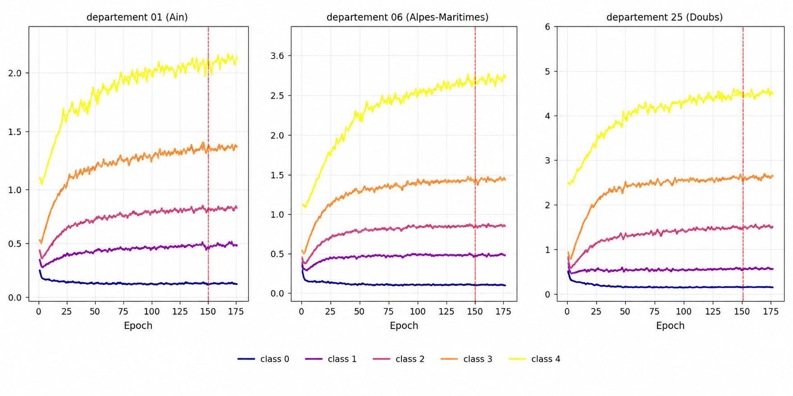
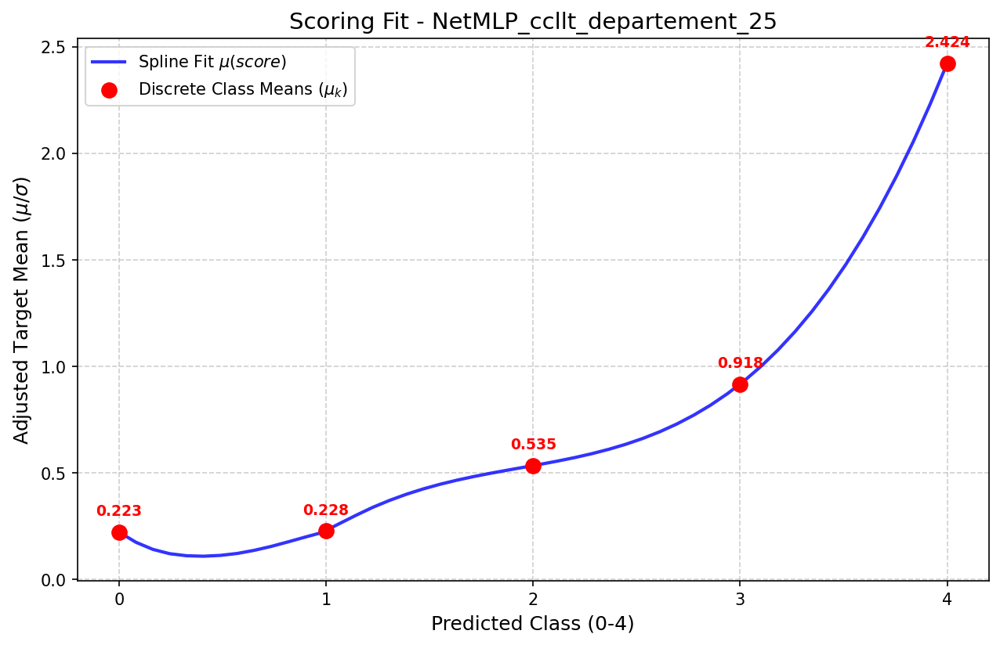
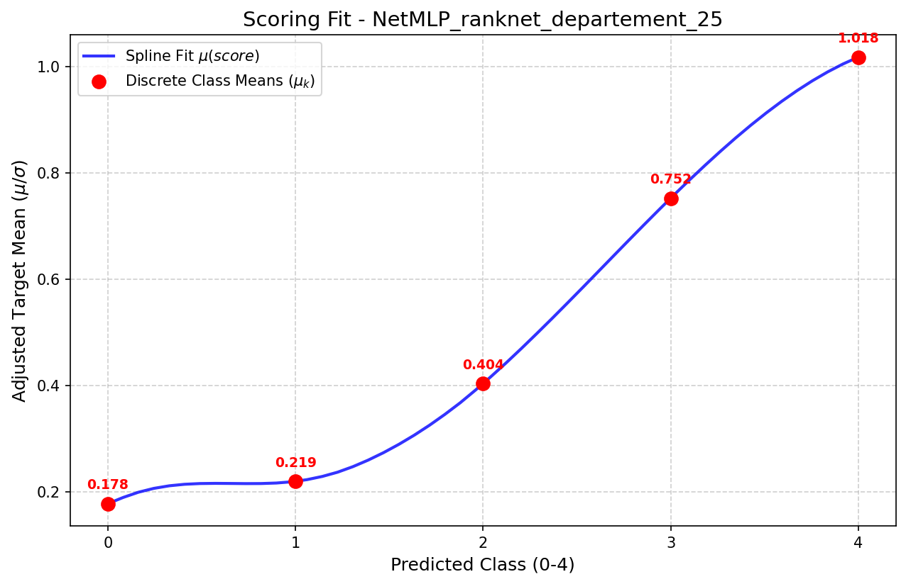

# Learning Operational Ordinal Wildfire Risk Signals with Monotonic Ranking Constraints

This repository contains a PyTorch implementation of ordinal loss functions for learning operational wildfire risk signals.  The central idea is to train a model to produce a latent continuous score whose ordered thresholds map naturally to coherent risk levels, while additional regularizers encourage the learned risk scale to remain monotonic, calibrated, and resistant to collapse into dominant low-risk classes.

## Abstract

Wildfire prediction is traditionally formulated as a classification or regression problem, although operational wildfire management primarily relies on coherent ordinal risk levels rather than exact event prediction. Moreover, recent studies have shown that evaluation protocols themselves can significantly influence wildfire model rankings, sometimes more than the backbone architecture. In this work, we propose a novel ordinal loss function designed specifically for operational wildfire risk learning. The proposed formulation combines latent ordinal centers, hierarchical EMA shrinkage priors, monotonic transition ranking constraints inspired by RankNet, coverage regularization, and adaptive threshold calibration in order to directly optimize the ordinal consistency of the risk signal. Unlike standard classification objectives, the proposed framework explicitly encourages monotonic operational transitions while preventing collapse toward dominant low-risk classes. Evaluation relies on a monotonic explainability framework measuring whether increasing predicted risk levels correspond to increasing observed operational consequences. The proposed approach aims to move wildfire prediction beyond event-centered metrics toward the construction of stable, interpretable, and operationally meaningful ordinal risk signals.

## Repository Contents

| Path | Description |
| --- | --- |
| `loss.py` | PyTorch loss implementations for operational ordinal wildfire risk learning. |
| `README.md` | Project overview and usage notes. |

## Main Components

### `ClusterCLMBinnedTransitionLoss`

`ClusterCLMBinnedTransitionLoss` is the main objective implemented in this repository. It learns ordinal thresholds over a latent score and combines multiple terms designed for operational risk learning:

- **Latent ordinal thresholding**: converts a continuous score into ordinal class probabilities using learned monotonic thresholds.
- **Cluster- and department-aware calibration**: supports global, cluster-specific, or department-specific thresholds through the `alphatype` option.
- **Soft class-center estimation**: estimates latent class centers from predicted class probabilities and continuous targets.
- **Hierarchical EMA shrinkage priors**: stabilizes class-center estimates with global, cluster, and department priors.
- **Monotonic transition ranking constraints**: penalizes violations where higher ordinal risk levels fail to correspond to higher latent operational consequences.
- **Coverage regularization**: encourages predicted ordinal distributions to match expected coverage distributions globally, by cluster, or by department.
- **Adaptive midpoint calibration**: aligns learned thresholds with score-space midpoints between adjacent ordinal centers.

The loss returns a dictionary that includes `total_loss` and individual diagnostic terms such as transition, coverage, midpoint, and center-prior components.

### `ClusterDepartmentRankNetLoss`

`ClusterDepartmentRankNetLoss` provides a lighter RankNet-style pairwise ordinal objective. It is useful when the primary goal is to learn a monotonic latent score and optional score-to-class thresholds without the full coverage and hierarchical center-prior machinery.

## Conceptual Workflow

A typical training workflow is:

1. Train any wildfire forecasting backbone that outputs a scalar latent risk score for each sample.
2. Pass the model score, continuous operational target, cluster identifier, and department identifier into one of the ordinal losses.
3. Optimize the returned `total_loss` or scalar loss together with the model parameters.
4. Use the learned thresholds to convert latent scores into ordinal operational risk levels.
5. Evaluate whether higher predicted risk classes correspond to increasing observed operational consequences.

## Results and Visualizations

The proposed approach directly optimizes ordinal consistency. Below are visualizations of the learned latent ordinal centers and the monotonic evaluation spline fits comparing the CCLLT objective and a baseline RankNet formulation on the prediction of operational wildfire consequences.

### Latent Ordinal Centers Evolution


*Evolution of the latent ordinal centers (`mu`) per class during training. The separation of these centers illustrates the model's capacity to naturally map increasing latent severity to monotonically increasing operational risk levels.*

### Monotonic Evaluation: CCLLT vs. RankNet

The performance is evaluated using a monotonic spline framework, measuring the degree to which increasing predicted risk classes correspond to increasing operational burden.

**CCLLT Loss Fit (Department 25)**

*Monotonic evaluation spline fit for the CCLLT objective, showing strong alignment between predicted risk classes and expected operational consequences.*

**RankNet Loss Fit (Department 25)**

*Monotonic evaluation spline fit for the baseline RankNet formulation, showing differences in risk transition points and coverage.*

## Minimal Usage Sketch

```python
import torch
from loss import ClusterCLMBinnedTransitionLoss

criterion = ClusterCLMBinnedTransitionLoss(
    num_classes=5,
    sigma=1.0,
    nclusters=10,
    ndepartements=4,
    alphatype="department",
)

score = torch.randn(32)              # model output: latent risk score
y_cont = torch.rand(32) * 10.0       # continuous operational consequence target
clusters = torch.randint(0, 10, (32,))
departments = torch.randint(0, 4, (32,))

losses = criterion(
    score=score,
    y_cont=y_cont,
    clusters_ids=clusters,
    departement_ids=departments,
    current_epoch=0,
)

total_loss = losses["total_loss"]
total_loss.backward()
```

After training, learned thresholds can be used to map scores to ordinal classes:

```python
predicted_risk_class = criterion.score_to_class(
    scores=score,
    departement_ids=departments,
)
```

## Inputs Expected by the Main Loss

- `score`: model-predicted scalar latent score for each example.
- `y_cont`: continuous target representing the observed consequence or severity signal.
- `clusters_ids`: cluster identifiers used for group-aware class-center estimation and optional thresholding.
- `departement_ids`: department identifiers used for department-aware thresholding and hierarchical priors.
- `current_epoch`: integer epoch index used for warmup behavior and regularization scheduling.
- `sample_weight` *(optional)*: non-negative per-sample weights.

## Dependencies

The implementation is written for Python and PyTorch. The current `loss.py` file also imports utilities from an external `forecasting_models.pytorch` package, so this repository is intended to be used inside the forecasting codebase or environment where those modules are available.

Core dependency:

```text
torch
```

## Notes

- The code focuses on loss definitions and threshold/risk-level calibration rather than a complete data pipeline or training script.
- The loss is designed for ordinal wildfire risk learning, but the same structure can be adapted to other operational risk settings where ordered levels are more important than exact point prediction.
- Operational evaluation should emphasize monotonic consistency: higher predicted risk levels should correspond to higher observed consequences, resource demands, or other downstream management signals.

## Citation

If you use or extend this repository, please cite it as the accompanying implementation for *Learning Operational Ordinal Wildfire Risk Signals with Monotonic Ranking Constraints*.
